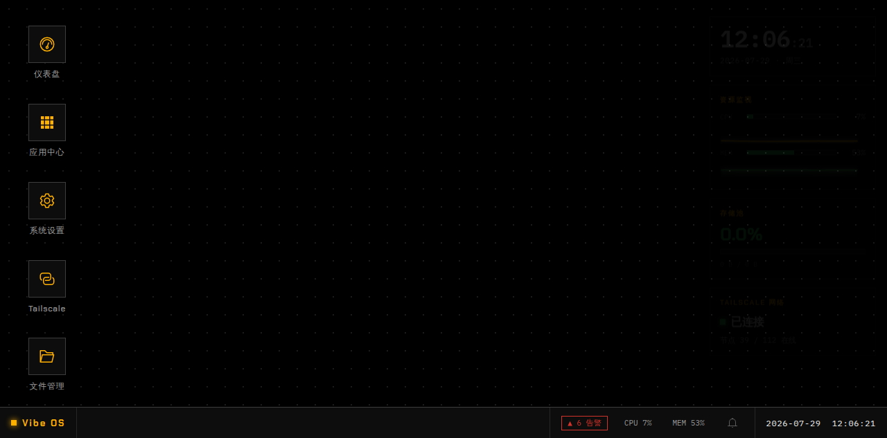
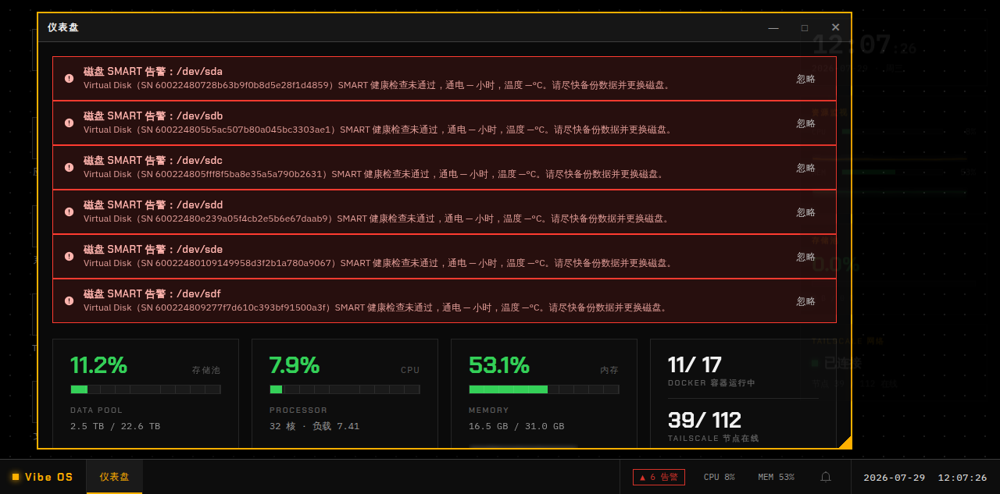
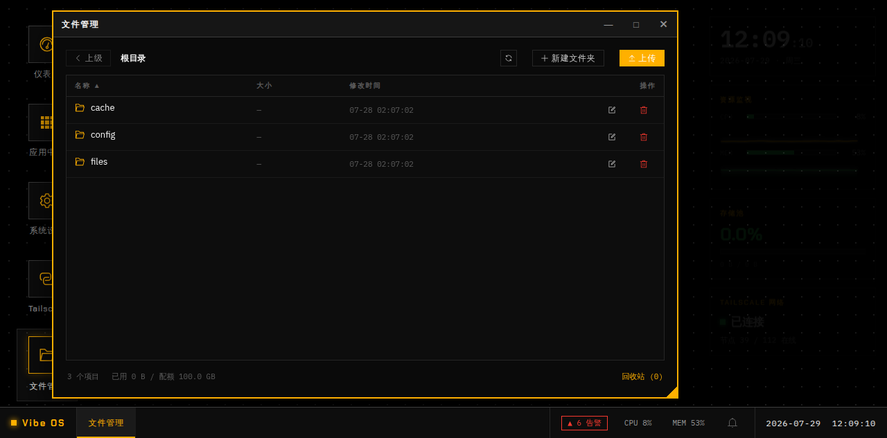
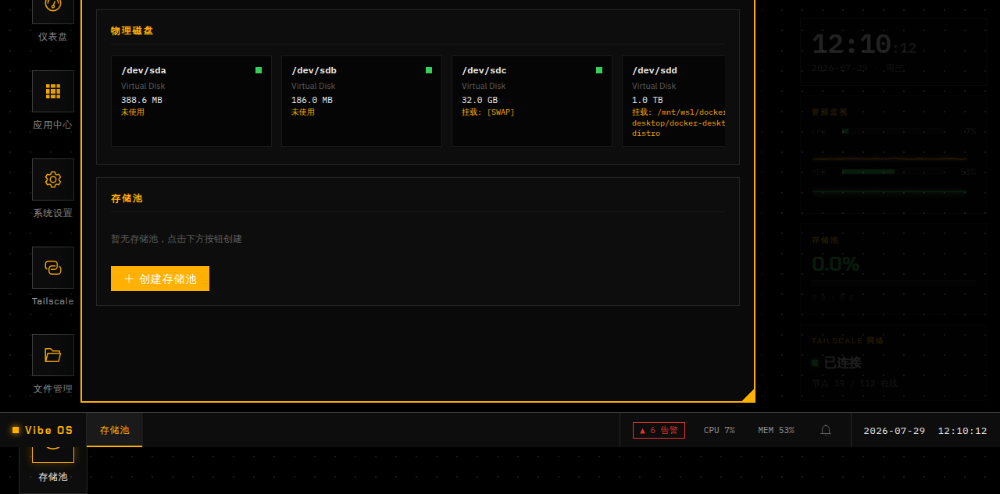
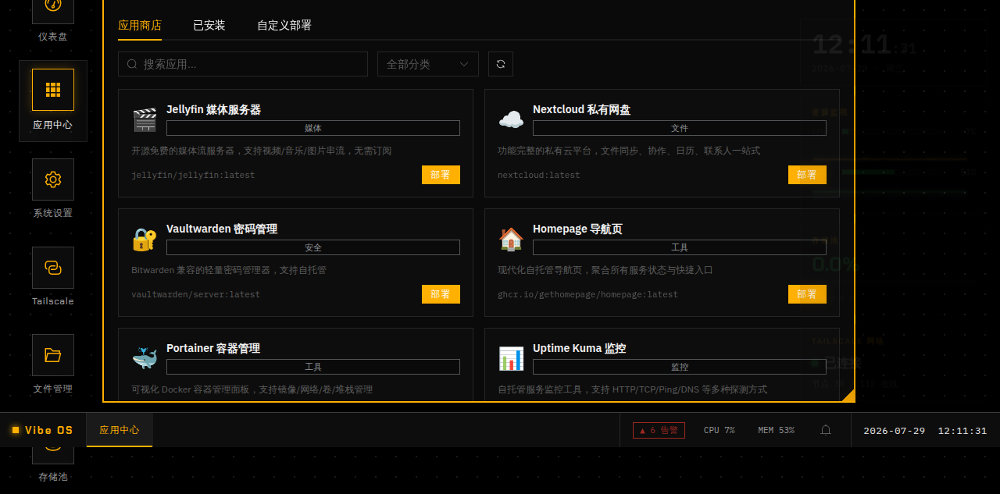
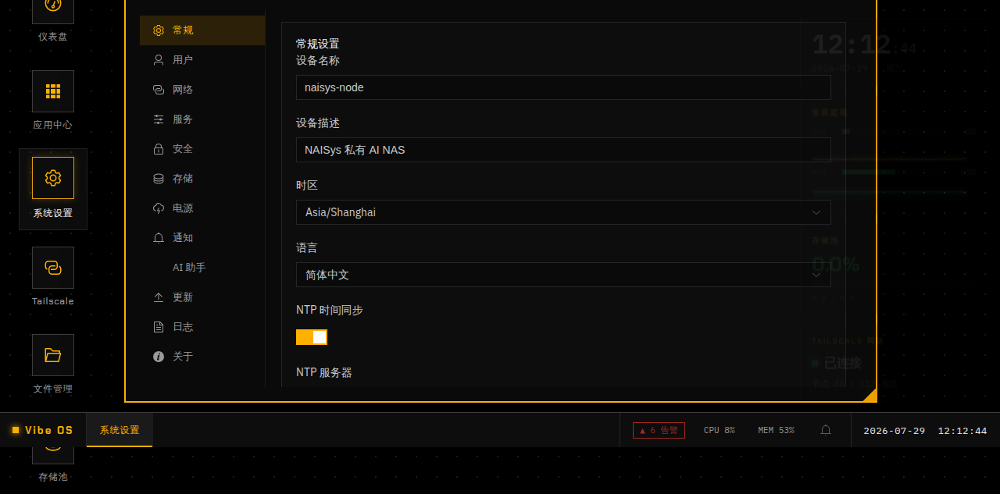

# Vibe OS — 开源私有 AI NAS 操作系统

> 基于 Debian 13 的本地化私有 AI NAS 系统，面向内网/离线环境，提供本地 AI 推理、文件管理、应用托管、存储管理等能力。所有数据与服务完全本地化，零外网依赖。

> An open-source private AI NAS operating system built on Debian 13, designed for intranet/offline environments. Provides local AI inference, file management, app hosting, and storage management. All data and services are fully localized with zero external network dependency.

---

## 功能特性 / Features

### WebOS 桌面 / WebOS Desktop

基于浏览器的桌面环境，黑底琥珀工业风设计，支持窗口拖拽、最大化、任务栏、桌面小组件。

A browser-based desktop environment with a dark industrial design (black + amber). Supports window dragging, maximize, taskbar, and desktop widgets.



### 系统仪表盘 / System Dashboard

实时监控系统资源：CPU、内存、存储池使用率、Docker 容器状态、Tailscale 网络节点、磁盘 SMART 健康告警。

Real-time system monitoring: CPU, memory, storage pool usage, Docker container status, Tailscale network nodes, and disk SMART health alerts.



### 文件管理 / File Manager

Web 端文件浏览器，支持上传、下载、新建文件夹、重命名、删除、回收站、配额管理。路径穿越防护确保数据安全。

Web-based file browser with upload, download, folder creation, rename, delete, recycle bin, and quota management. Path traversal protection ensures data security.



### 存储池管理 / Storage Pool

物理磁盘识别、SMART 健康监控、存储池创建（支持 RAID）、扩容、Scrub 校验。

Physical disk discovery, SMART health monitoring, storage pool creation (RAID support), expansion, and scrub verification.



### 应用中心 / App Center

内置应用商店（Jellyfin、Nextcloud、Vaultwarden、Homepage、Portainer、Uptime Kuma 等），一键 Docker Compose 部署，支持自定义镜像和 LLM 仓库分析。

Built-in app store (Jellyfin, Nextcloud, Vaultwarden, Homepage, Portainer, Uptime Kuma, etc.) with one-click Docker Compose deployment, custom image support, and LLM-powered repository analysis.



### 系统设置中心 / Settings Center

12 个设置分区：常规、用户与权限、网络、服务管理、安全、存储、电源、通知、AI 助手、更新、日志、关于。

12 settings sections: General, Users & Permissions, Network, Services, Security, Storage, Power, Notifications, AI Assistant, Updates, Logs, About.



### 更多功能 / More Features

| 功能 / Feature | 说明 / Description |
|---|---|
| 共享文件夹 / Shared Folders | SMB / NFS / WebDAV 协议共享，ACL 权限控制 |
| 备份中心 / Backup Center | rsync 定时备份、文件系统快照、一键恢复 |
| 下载中心 / Download Center | aria2 集成，支持 HTTP / BT / 磁力链接 |
| 网络配置 / Network Config | 接口管理、DNS、防火墙、端口监控、WoL |
| 计划任务 / Task Scheduler | Cron 可视化管理、执行历史、立即运行 |
| 通知中心 / Notification Center | 告警持久化、Webhook / Email 推送、免打扰 |
| Tailscale 网络 | 多账户管理、ACL 策略编辑器、节点监控 |
| 用户管理 / User Management | 用户创建、配额、数据目录隔离 |
| ISO 构建 / ISO Build | GitHub Actions + xorriso + squashfs 自动化构建 |

---

## 技术栈 / Tech Stack

| 层级 / Layer | 技术 / Technology |
|---|---|
| 系统底座 / OS Base | Debian 13 (Trixie) amd64 |
| 后端 / Backend | Node.js ≥ 22 + Express 5 + TypeScript (strict) |
| 前端 / Frontend | Vue 3 + Vite + Element Plus + Pinia |
| 包管理 / Package Manager | pnpm (workspace monorepo) |
| 测试 / Testing | Vitest + Supertest |
| Lint | ESLint (flat config) + Prettier |
| 构建 / ISO Build | GitHub Actions + xorriso + squashfs-tools |
| 容器 / Container | Docker + systemd service (非 root / non-root) |

---

## 项目结构 / Project Structure

```
Vibe-OS/
├── src/                        # 后端源码 / Backend source
│   ├── app.ts                  # Express 应用入口
│   ├── config.ts               # 全局配置
│   ├── server.ts               # HTTP 服务启动
│   ├── common/                 # 公共模块（错误处理、中间件、校验）
│   └── modules/                # 业务模块（15 个）
│       ├── apps/               # 应用中心
│       ├── backup/             # 备份与快照
│       ├── container/          # Docker 容器管理
│       ├── download/           # 下载中心
│       ├── filemanager/        # 文件管理
│       ├── hardware/           # 硬件与 SMART
│       ├── metrics/            # 系统指标
│       ├── network/            # 网络配置
│       ├── notification/       # 通知中心
│       ├── scheduler/          # 计划任务
│       ├── settings/           # 系统设置中心
│       ├── sharing/            # 共享文件夹
│       ├── storage/            # 存储池
│       ├── system-init/        # 系统初始化
│       └── user/               # 用户管理
├── web/                        # 前端源码 / Frontend source
│   └── src/
│       ├── api/                # API 客户端 + 类型 + 演示数据
│       ├── components/         # 组件（settings/users/apps/dashboard/desktop）
│       ├── stores/             # Pinia stores（wm/system/settings）
│       └── views/              # 页面视图（14 个）
├── iso/                        # ISO 构建脚本与配置
│   ├── build-iso.sh            # ISO 构建主脚本
│   ├── preseed/                # Debian 自动安装应答
│   ├── systemd/                # systemd 服务单元
│   └── runtime/                # 运行时配置
├── docs/                       # 文档
│   └── screenshots/            # 功能截图
├── tasks/                      # Agent 开发任务书
├── AGENTS.md                   # Agent 行为规范（强制）
└── package.json                # Monorepo 根配置
```

---

## 快速开始 / Quick Start

### 环境要求 / Prerequisites

- Node.js ≥ 22.x
- pnpm ≥ 9.x
- Docker（可选，用于容器管理功能）

### 安装与运行 / Install & Run

```bash
# 克隆仓库
git clone <repo-url> && cd Vibe-OS

# 安装依赖
pnpm install

# 启动后端（开发模式，数据目录指向临时路径）
VIBEOS_DATA_ROOT=/tmp/vibeos-data pnpm dev

# 启动前端（另一个终端）
pnpm web:dev
```

后端默认运行在 `http://127.0.0.1:3000`，前端运行在 `http://127.0.0.1:5173`。

Backend runs on `http://127.0.0.1:3000`, frontend on `http://127.0.0.1:5173` by default.

### 构建 / Build

```bash
# 后端编译
pnpm build

# 前端编译
pnpm web:build

# 运行测试
pnpm test

# 代码检查
pnpm lint
```

### ISO 构建 / ISO Build

```bash
cd iso
# 需要 xorriso + squashfs-tools
sudo ./build-iso.sh
```

详见 [ISO 构建指南](docs/iso-build-install-guide.md)。

See [ISO Build Guide](docs/iso-build-install-guide.md) for details.

---

## 数据目录规范 / Data Directory Layout

```
/data/                              # 用户数据根目录（唯一合法数据根）
├── {uid}/                          # 用户个人空间（以用户 ID 隔离）
│   ├── files/                      # 用户文件
│   ├── config/                     # 用户配置
│   └── cache/                      # 用户缓存
└── vibeos/                         # AI 系统应用目录
    ├── {appname}/                  # 各 AI 应用独立目录
    │   ├── models/                 # 模型文件
    │   ├── data/                   # 应用数据
    │   └── logs/                   # 应用日志
    ├── secrets/                    # 密钥存储（0700 权限）
    ├── settings/                   # 系统设置持久化
    └── cache/                      # 系统级缓存
```

开发环境可通过 `VIBEOS_DATA_ROOT` 环境变量覆盖数据根目录。

In development, override the data root via the `VIBEOS_DATA_ROOT` environment variable.

---

## 认证与 SSO / Authentication & SSO

Vibe OS 内置完整的 OpenID Connect Provider，NAS 本身即统一身份源：

- **本地账号**：bcrypt 哈希（cost 12）、服务端 session（`vibeos.sid` cookie，24h 有效）、登录失败 5 次锁定 15 分钟
- **初始管理员**：首次启动自动创建 `admin`，密码取 `VIBEOS_ADMIN_PASSWORD`（默认 `vibeos`），强制首次登录改密
- **OIDC Provider**：标准授权码流程 + PKCE（S256），RS256 签名，密钥自动轮换（多 kid 并存，旧 kid 保留 7 天）
- **认证链**：Session Cookie（Web UI）→ Bearer Token（API/OIDC）→ `VIBEOS_API_TOKEN` 紧急后门（已废弃，仅运维用）；开发模式 `VIBEOS_AUTH_DISABLED=true` 跳过认证
- **客户端管理**：设置中心 → 应用授权，注册/禁用/重置 secret（secret 仅显示一次）

OIDC 端点：

| 端点 | 说明 |
|------|------|
| `/.well-known/openid-configuration` | 发现文档 |
| `/oidc/jwks.json` | JWKS 公钥集 |
| `/oidc/authorize` | 授权端点 |
| `/oidc/token` | 令牌端点（限流 30 次/分钟/IP） |
| `/oidc/userinfo` | 用户信息 |
| `/oidc/revoke` / `/oidc/introspect` | 令牌撤销 / 内省 |
| `/oidc/end-session` | RP-Initiated Logout |

第三方应用接入参见 `docs/oidc-integration-guide.md`。密钥存储于 `/data/vibeos/secrets/oidc-keys.json`（0700），首次启动自动生成 RSA 2048。

---

## 安全设计 / Security

- 所有服务以非 root 用户 `vibeos` 运行
- 文件操作限定在 `/data/` 目录树内，路径 normalize + 前缀校验防穿越
- 禁止硬编码密钥，使用环境变量或 `/data/vibeos/secrets/`（0700）
- API 默认拒绝未认证请求
- 系统操作通过原子化 API 层封装，禁止裸 shell 命令
- 纯内网运行，零外网请求，零遥测

All services run as non-root user `vibeos`. File operations are confined to `/data/` with path normalization and prefix validation. No hardcoded secrets — use env vars or `/data/vibeos/secrets/` (0700). APIs reject unauthenticated requests by default. System operations go through an atomic API layer. Fully offline — zero external requests, zero telemetry.

---

## 开发规范 / Development Guidelines

详见 [AGENTS.md](AGENTS.md)，核心要点：

- TypeScript strict mode，禁止 `any`
- Conventional Commits 提交规范
- 功能分支开发，PR 合并，禁止直接提交 main
- 每个 PR 必须包含：代码 + 测试 + 文档
- 测试覆盖率 ≥ 80%
- 自动迭代：lint → build → test，不通过自行修复（5 轮上限）

See [AGENTS.md](AGENTS.md) for full development guidelines. Key points: TypeScript strict mode, Conventional Commits, feature-branch workflow with PR review, mandatory tests + docs per PR, ≥80% coverage, auto-fix loop (lint → build → test, max 5 rounds).

---

## 许可证 / License

MIT
